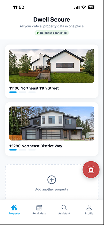
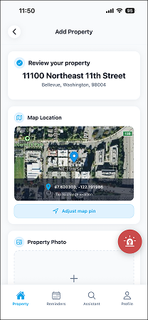
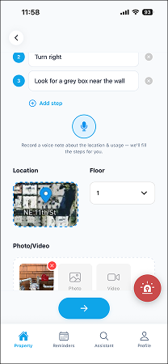
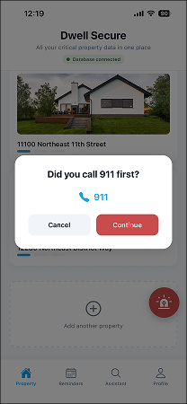
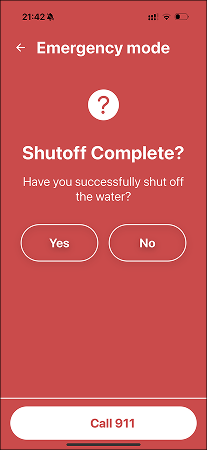
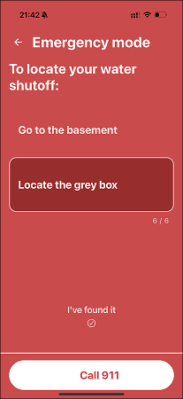
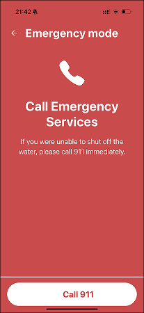

# Dwell Secure — User Manual

**User manual images:** All figures and screenshots for this manual are stored in **`assets/screenshots/`**. The key files are: `logo.png` (cover logo), `property_list.png` (app running), `add_property.png`, `add_shutoff.png`, `entry_emergency.png`, `confirm_emergency_stage.png`, `emergency_guidance.png`, and `call_911.png`.

---

## Cover Page

- **Project title:** Dwell Secure  
- **Version:** 1.0  
- **Team members:** Yu Shi, Shiyi Chen, Cherry Mathew Roy  
- **Instructor name:** *Mark Licata, Luyao Niu*  
- **Industrial sponsor (if applicable):** *Andrew Leith, Kristi Jensen*  
- **Submission date:** *Mar 12, 2026*

---

## 1. Product Overview

**What the product is**  
Dwell Secure is a mobile app that lets you record where your main utility shutoffs (gas, electric, water) are and how to use them. You can add photos, step-by-step instructions, and reminders. In an emergency, you can open **Emergency Mode** to quickly see the right shutoff and follow the steps without editing.

**The problem it solves**  
In emergencies (e.g. gas leak, water leak, electrical issue), people often don’t know where shutoff valves or breakers are or how to use them. Paper notes get lost or are hard to read under stress. Dwell Secure keeps this information in one place on your phone and shows it quickly when needed.

**Who it is designed for**  
- Property owners and renters  
- Households that want one place for shutoff locations and procedures  
- Anyone who wants fast, read-only access to that information in an emergency  

**Primary features**  
- **Properties:** Add one or more properties (e.g. home, rental).  
- **Shutoffs:** For each property, add gas, electric, and water shutoff records with location, photos, and step-by-step instructions.  
- **Utilities:** Track other utility-related items (e.g. filters, maintenance) with photos and notes.  
- **Reminders:** Schedule maintenance reminders; mark them complete from the list or from detail screens.  
- **Emergency Mode:** One-tap access: choose property → choose shutoff type → follow steps; optional quick link to call emergency services.  
- **Photos:** Attach photos to properties, shutoffs, and utilities; stored online when the backend is configured.  
- **Offline:** App works with data stored on the device when the server is unavailable and can sync when back online.  

---

## 2. System Requirements

- **Supported operating systems:**  
  iOS (Expo Go or built app), Android (Expo Go or built app), Web (Expo for web).

- **Hardware requirements:**  
  Smartphone or tablet with camera (for photos), or a computer for web. Sufficient free storage for the app and cached data.

- **Dependencies (for installation/development):**  
  Node.js, npm or yarn. For running on a physical device during development: Expo Go app. For production use: built app binary or web build.

- **Internet requirements:**  
  Required for sign-up, login, and syncing to the cloud. Optional for daily use once data is loaded; the app can run offline and sync when back online.

- **Required user accounts:**  
  An in-app account (email + password). No third-party account (e.g. Google, Apple) is required.

- **Package contents (physical):**  
  This is a software-only project; there are no physical items in the box.  

---

## 3. Installation and Setup

Follow these steps as a first-time user (no prior setup assumed).

**Step 1 – Install Node.js**  
Download and install Node.js (LTS) from https://nodejs.org. Verify in a terminal: `node -v` and `npm -v`.

**Step 2 – Backend (if you run your own server)**  
1. Open a terminal and go to the project’s `server` folder.  
2. Run `npm install`.  
3. **Environment variables:** Copy the example file to create your config: copy `server/.env.example` to `server/.env` (e.g. `copy .env.example .env` on Windows, or `cp .env.example .env` on Mac/Linux). Open `server/.env` and set at least:  
   - `MONGODB_URI=<your MongoDB connection string>`  
   - `JWT_SECRET=<a long random secret>`  
   All available options are listed and explained in `server/.env.example` and `server/README.md`.  
4. Run `npm start`. The server should start and connect to MongoDB. Leave this terminal open.

**Step 3 – Frontend (Expo app)**  
1. Open a **new** terminal and go to the project root (folder that contains `package.json` and `src`).  
2. Run `npm install`.  
3. Run `npm start`.  
4. To run on a **phone:** Install “Expo Go” from the App Store or Google Play, then scan the QR code shown in the terminal (phone and computer on same network).  
5. To run on **simulator:** Press `i` (iOS) or `a` (Android) in the terminal.  
6. To run in **browser:** Press `w`.

**Step 4 – Point app at backend (if using local server)**  
If you use a local backend, either: (a) copy the project root **`.env.example`** to **`.env`** in the project root and set `EXPO_PUBLIC_API_URL` to your server (e.g. `http://<your-computer-ip>:3000`), or (b) set the API base URL in `src/config/api.js`. Restart the Expo app after changing `.env`.

---

## 4. Operating Instructions

**Starting the system**  
- **Backend:** In the `server` folder, run `npm start`.  
- **App:** From project root, run `npm start`, then choose device/simulator/web. Open the app on the device or in the browser.

**Using the system – primary tasks**

- **Create an account:** Open the app → tap Sign up → enter email and password (and any other required fields) → submit. You are logged in.  
  

- **Add a property:** Go to the Property/Shutoffs area → add or select a property → enter address and details, optionally add a photo → save.  
  

- **Add utility shutoff records:** Go to Shutoffs → Add → select property → choose type (Gas, Electric, Water) → enter location/description, add photos and step-by-step instructions → save.  
  

- **Activate Emergency Mode:** On the main screen, tap the **red floating button** → select property (if more than one) → select shutoff type → follow on-screen steps. Use “Call Emergency Services” if needed. To exit Emergency Mode, use the exit option on the Emergency Mode screen; the app returns to normal use.  
    
    
    
  

**Shutting down the system**  
- **App:** Close the app as you would any other app (swipe away or exit the browser tab). No special shutdown procedure is required; data is saved automatically.  
- **Backend:** In the terminal where the server is running, press `Ctrl+C` to stop the server.  
- **Exiting Emergency Mode:** Use the exit/back option on the Emergency Mode screen so the app returns to normal (editing enabled again).  

---

## 5. Technical Specifications

- **Architecture:**  
  - Client: React Native (Expo) app communicating with the backend over HTTPS.  
  - Backend: Express.js REST API; MongoDB for persistence; optional Firebase Storage for media.  
  - Data flow: App uses a single configurable API base URL; storage layer calls the API first and falls back to AsyncStorage when the server is unavailable.

- **Technologies used:**  
  Frontend: React Native, Expo SDK 54, React Navigation, AsyncStorage. Backend: Node.js, Express, MongoDB driver, JWT, bcrypt. Media: Firebase Storage (server-side upload via firebase-admin and multer). Optional: OpenAI (voice-note, AI), Mapbox (geocode, maps).

- **Database:**  
  MongoDB database (e.g. `dwellsecure`) with collections: `users`, `properties`, `shutoffs`, `utilities`, `reminders`, `password_reset_tokens`. Data is user-scoped. Address/geo fields can be stored encrypted when `ADDRESS_ENCRYPTION_KEY` is set on the server.

- **Integrations:**  
  REST API for auth and CRUD; optional OpenAI and Mapbox proxied through the backend. Client uses JWT for authenticated requests. Offline caching via AsyncStorage with sync when the API is available again.

---

## 6. Safety, Data Privacy, and Security

**Data privacy considerations**  
- Account and property data are stored on the server (and optionally cached on the device). Only you can access your data after logging in.  
- Address and location data can be encrypted in the database when the server is configured with an encryption key; the key is kept on the server, not in the app.  
- When the app is offline, data is stored locally on the device in plain form (no app-level encryption). Use device lock and keep the device and OS updated to reduce risk of unauthorized access.

**Security warnings**  
- Use a strong, unique password. Do not share your login credentials.  
- Use the app only over a trusted network; the app expects HTTPS for the backend in production.  
- If you suspect your account is compromised, change your password and contact support if available.

**Known operational limitations**  
- Password reset tokens are created on the server but email delivery is not implemented; users cannot receive a reset link by email unless an email service is integrated.  
- In Emergency Mode, creating or editing shutoffs/utilities is disabled until you exit Emergency Mode.  
- Offline sync does not perform full conflict resolution; the last write or server state may override local changes when syncing.  
- Map and geocode features require a Mapbox token and network; they may be unavailable if the token is missing or the service is down.  

---

## 7. Troubleshooting

- **App shows “MongoDB not connected” or similar:**  
  The backend is unreachable (server not running, wrong URL, or network issue). The app will still work with local data. Check that the server is running and that the app’s API URL (in `src/config/api.js` or env) is correct.

- **Photos do not upload:**  
  Ensure the backend has Firebase Storage configured (`FIREBASE_STORAGE_BUCKET` and service account). Otherwise the upload endpoint will fail or return an error.

- **Cannot create or edit shutoffs/utilities:**  
  If you are in Emergency Mode, editing is disabled. Exit Emergency Mode from the Emergency Mode screen, then try again.

- **Forgot password:**  
  Use “Forgot password” on the login screen. The server creates a reset token; email delivery must be configured separately for the user to receive a link.

- **Voice or AI features not available:**  
  The server must have `OPENAI_API_KEY` set and the corresponding routes deployed; otherwise those features return an error or 404.

- **Backend fails to start (e.g. MongoDB connection error):**  
  Check that `MONGODB_URI` in `server/.env` is correct, that the MongoDB cluster is not paused, and that your IP is allowed in MongoDB Atlas Network Access.

---

## 8. Limitations

- **Password reset:** Reset tokens are stored on the server but email is not sent; users cannot receive the reset link by email unless an email service is integrated.  
- **Emergency Mode:** Shutoffs and utilities cannot be created or edited while in Emergency Mode; the app is read-only for that flow.  
- **Offline sync:** Conflict resolution for simultaneous edits on multiple devices is limited; last-write or server state may override local changes.  
- **Platform differences:** Behavior that depends on native modules (e.g. some notifications or file access) may differ between iOS, Android, and web.  
- **Map/geocode:** Requires Mapbox token and network; address lookup and map display may be unavailable if the token is missing or the service is down.  
- **Other unfinished or constrained features:** Any additional known constraints or unfinished features should be listed here by the team.  

---

*End of User Manual. Manual images live in `assets/screenshots/` (see filenames used above, e.g. `logo.png`, `property_list.png`, `add_property.png`, `add_shutoff.png`, `entry_emergency.png`, `confirm_emergency_stage.png`, `emergency_guidance.png`, `call_911.png`). Update team, instructor, sponsor, and date as needed. Export to PDF and add `docs/USER_MANUAL.pdf` to the repo for submission.*
